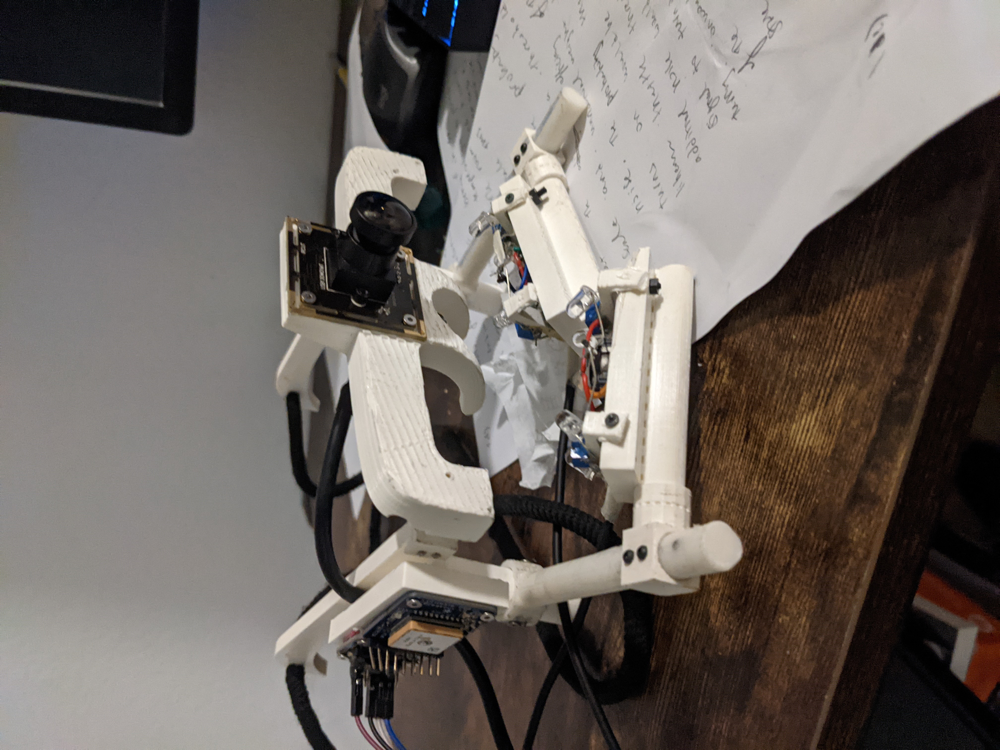
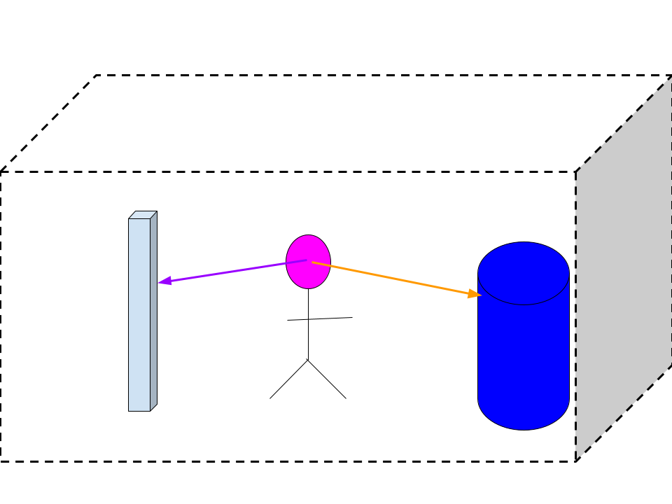

# Title:
6-DOF Monocular SLAM-Based Wearable Eye-Gaze Tracker with Inertial Tracking 

### Summary:
Wearable Eye-Gaze Techonology allow for users to track their gaze in an enviroment given by an outer-viewing camera, but does not allow for information related to depth. By integrating Monocular SLAM into wearable eye-gaze technology, we can get 6-DOF information of the user and get features of the gaze related to the depth of view. 

### Splash images

### Project git repo(s):
https://github.com/therhetoricalcow/Wearable_Eye_SLAM
## Big picture 

### What is the overall problem that this and related research is trying to solve?
Predicting Gaze has been tackled over the last 20 years but most modern state of the art gaze trackers rely on predicting gaze position onto a 2-Dimensional Location. In use cases like Neurology and Augmented Reality, the users would want to know how far a certain object is from the user as well as allowing the user to move around the environment while still tracking location. Satellite GPS is unable to assist with localization due to the large amount of errors in measuring distance (10-15 meters). This research solves this by allowing for a precise low-cost mapping solution that localizes the user and can determine not only where the user is looking at but exactly what specified object in a mapping they are looking at. It allows the user to map the environment with a custom-monocular wearable eye-tracker. After mapping the environment, the user localizes their location and can use a comibination of the 3-D mapping, Head Pose attaned for Inertial Measuring Units, and eye-tracking system to determine the user's gaze. 
### Why should people (everyone) care about the problem?
This problem is of uptmost importance as it moves from using outside-in tracking to inside-out tracking for eye-tracking wearables. Current inside-out tracking devices rely on binocular tracking methods, but recent progresses in technology has made monocular SLAM for indoor-tracking a feasible solution. 
### What has been done so far to address this problem?
Tobii's Pico Neo 2 Eye and Vive Pro Eye utilizes inside out tracking but with binocular environmental cameras. Pupil Labs has an environment camera but maps the gaze direction to a corresponding position in an environmental 2-D Image 
## Specific project scope
### What subset of the overall big picture problem are you addressing in particular?
We want to see the effectiveness and performance of using Monocular SLAM with different eye-tracking methods.
### How does solving this subproblem lead towards solving the big picture problem?
This solution allows for a more cost-effective approach at fusing eye-tracking with slam. Current Headsets use binocular for tracking but Monocular Based Methods are not used. 
### What is your specific approach to solving this subproblem?
ORB3-SlAM will be used to implement SLAM onto a Monocular Fish-Eye Camera, the IMU can return the result as a Quaternion and can be fused with the SLAM solution. Gaze Tracking can be done with 2 Near Infrared Webcams that either use Edge-Based Machine Learning or Feature-Based Ellipse Fitting to Figure out Pupil Ellipsing.
### How can you be reasonably sure this approach will result in a solution?
The ORB3-Slam will allow for some sort of Indoor Mapping. By using a variety of fusion and calibration practices, we can determine the effectiveness of Monocular Indoor Slam for Eye Tracking By determining gaze effectiness at different distances. 
### How will we know that this subproblem has been satisfactorily solved, using quantitative metrics?
By observing the root-mean square error of percieved gaze and true gaze upon different features picked out by the SLAM, we can use quantitative metrics to determine the accuracy and statistics behind the setup. 
## Broader impact
(even if someone doesn't care about the big picture problem that you started with, why should they still care about the specific work that you've produced?  Who else can use your processes and results, and how?)

### What is the value of your approach beyond this specific solution?
This allows for the Field of Neurology and AR/VR Solutions to be incentized to try more cost effective solutions with high-accuracy. It allows for a custom 6-DOF headset that is not commercialized but can be open-sourced. 
### What is the value of this solution beyond solely solving this subproblem and getting us closer to solving the big picture problem?

## Background / related work / references
Link to your literature review in your repo.

## System capabilities, validation deliverables, engineering tasks

### Concrete external deadlines (paper submissions):
Include dates as well as target proposed title / abstract for expected submission

### Detailed schedule (weekly capabilities / deliverables / tasks):
Link to schedule in your repo.
